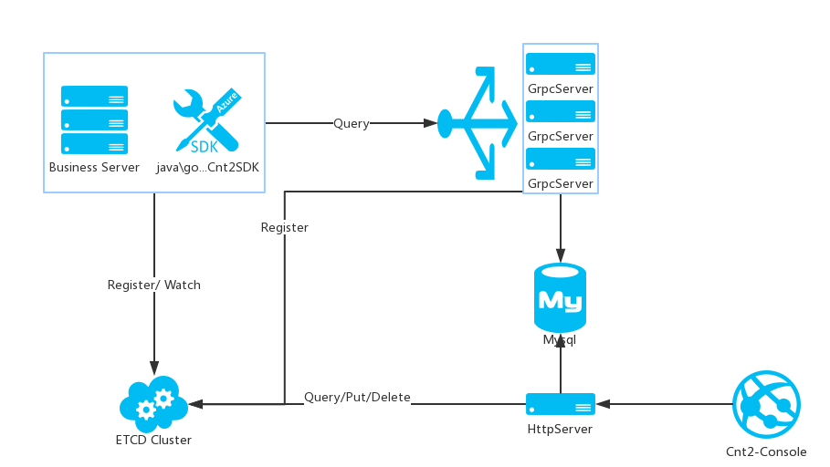
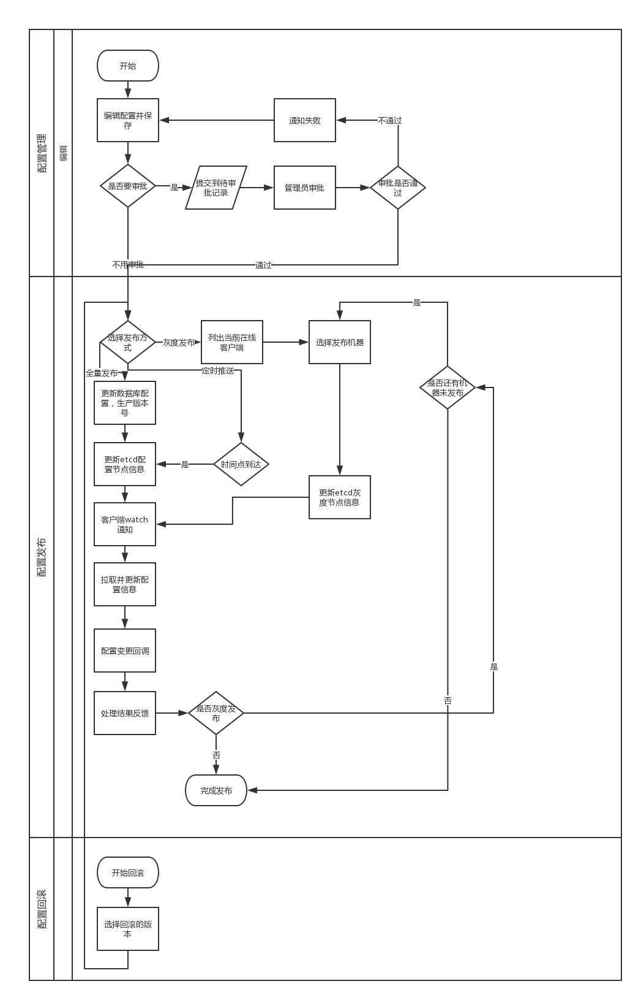

[console]: https://github.com/yy-java/cnt2-console
[gosdk]: https://github.com/yy-java/cnt2-gosdk
[javasdk]: https://github.com/yy-java/cnt2-javasdk
[etcd]: https://github.com/coreos/etcd
[etcd-cluster-install]: https://github.com/coreos/etcd/blob/master/Documentation/op-guide/clustering.md
[go-install]: https://golang.org/dl/

# cnt2

   cnt2是高可用的分布式配置中心, 是config center v2的简写， v2版本是在我们公司使用的v1版本上改进而来的。
采用go语言编写，客户端通过监听[etcd][etcd]集群感知配置的变化，再通过gRPC调用GrpcServer服务查询保存在
Mysql中最新的配置信息。

具有如下的功能:

* *实时性* : 一键发布，立马生效
* *多环境* : 自定义环境，一般分，开发、测试、生产环境1、生产环境2...生产环境N。多生产环境间接实现了分集群配置管理。
* *灰度发布* : 灰度发布，降低风险
* *配置回滚* : 能查看配置的历史版本，可以回滚到任意一个版本
* *审核机制* : 只能发布已审核的配置，出了问题拉上审核者一块来背锅^_^
* *权限管理* : 基于App的维度分管理员和开发者，还可以设置超级管理员来管理所有的App
* *后台管理* : 清新简洁的[管理后台][console]，与HttpServer进程提供的接口交互。
* *客户端SDK* : 目前提供[java][javasdk] 和 [go][gosdk] 两种语言的SDK

## 项目结构图


各模块解释：
1. **GrpcServer** : GrpcServer进程，用于提供查询配置信息接口。 
2. **HttpServer** : HttpServer进程，用于给Cnt2-Console提供查询和操作接口。
3. **Cnt2-Console** : 管理后台进程。
4. **Business server** : 业务进程，通过sdk与配置中心交互。
5. **SDK** : 业务进程使用，SDK监听ETCD节点信息，当获得了变化，就去GrpcServer拉取最新的配置信息。
6. **ETCD CLUSTER** : ETCD集群
7. **Mysql** : 配置信息等一些数据存储。


## 流程图



## 开始

### 安装go

 [go][go-install]版本必须是1.9+
 
### 安装etcd集群

 查看[etcd集群安装文档][etcd-cluster-install]

### 建立Mysql库表
 通过mysql目录下cnt2_db.sql建库建表
 
 
### 安装必须的go依赖库
```
//beego
go get github.com/astaxie/beego 
//beego tools
go get github.com/beego/bee 
// etcd client
go get github.com/coreos/etcd/clientv3  
// mysql driver
go get github.com/go-sql-driver/mysql  
// test
go get github.com/smartystreets/goconvey 
```

### Download Code

```
cd ${GOPATH}/src

git clone https://github.com/yy-java/cnt2.git
```

修改httpserver和grpcserver目录下的conf配置文件，指向etcd集群和Mysql数据库

### 启动GrpcServer

cnt2也是一个自给自足的服务治理中心，所以建议部署多个GrpcServer实例，java/go sdk会轮询访问这些实例。
```
$ cd ${download-path}/cnt2/grpcserver

>>>>>Linux运行方式
$ bee pack -be="GOOS=linux"
//可以查看生成了grpcserver.tar.gz包
$ ll
//解压grpcserver.tar.gz后执行
$ tar -zxf grpcserver.tar.gz grpcserver
$ cd grpcserver
// 运行
$ /grpcserver &
<<<<<Linux运行方式

>>>>>Windows运行方式
$ bee pack -be="GOOS=windows" -f=zip
$ 可以看到一个grpcserver.zip，解压
$ 双击运行grpcserver.exe
<<<<<Windows运行方式
```

### 启动HttpServer

```
cd ${download-path}/cnt2/httpserver

>>>>>Linux运行方式
$ bee pack -be="GOOS=linux"
//可以查看生成了httpserver.tar.gz包
$ ll
//解压httpserver.tar.gz后执行
$ tar -zxf httpserver.tar.gz httpserver
$ cd httpserver
// 运行
$ /httpserver &
<<<<<Linux运行方式

>>>>>Windows运行方式
$ bee pack -be="GOOS=windows" -f=zip
$ 可以看到一个httpserver.zip，解压
$ 双击运行httpserver.exe
<<<<<Windows运行方式

### 启动Consle

请查看[管理后台][console]

